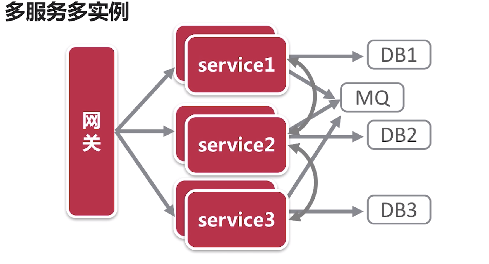

#  分布式系统 

## 定义
  
* 将不同的的组件分布在不同的服务器上，给用户提供一个统一的可靠的服务。

级别原则：
 
 * C一致性，事务
 * A 可用性，多实例
 * P 分区容错性,分区部署
 
 
 ## 一致性
 
 * 强一致性，几乎很难完成，单体服务器最好；
 * 弱一致性
 * 最终一致性
 
 
 ## base理论
 
 * BASE： Basically available (基本可用),soft state (软状态), Eventually consistent（最终一致性）
 * CAP原则中的一致性和可用性的权衡结果。
 
 
 ## 分布式系统
 
 * 多数据源  

 * 多服务

 

 * soa
 
 

 * 微服务

 

 ## 分布式系统设计需要考虑

 * 服务拆分
 * 数据拆分
 * 计算拆分
 * 服状态以及异常处理

 ## 微服务架构的组成

 * 服务发现与注册
 * 服务网关与负载均衡
 * 监控与熔断
 * 配置、消息

* spring cloud例子： 

 