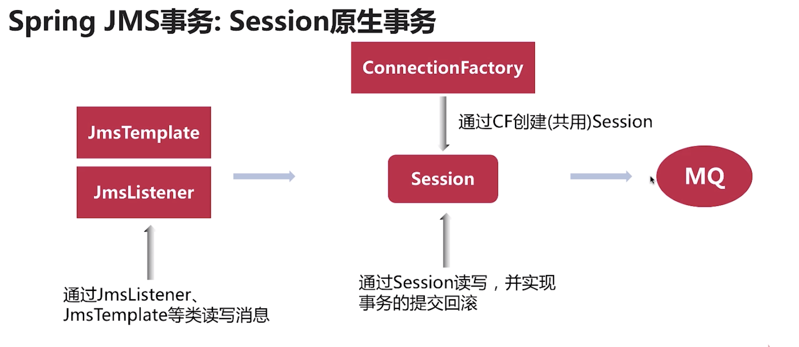
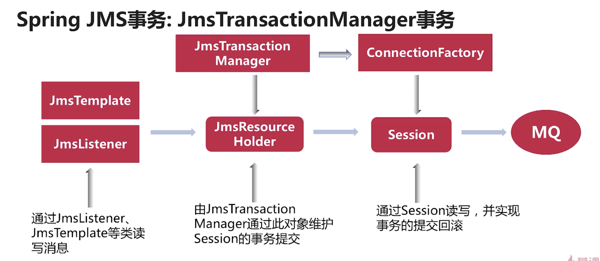

# jms事务例子

* spring boot 中使用JMS
* spring boot ActiveMQ starter
* 内置可运行的ActiveMQ服务器
* 实现读写activemq事务


## spring JMS事务类型

* session管理的事务；  
  
* 外部事务管理： JmsTransactionManger, JTA  



## spring 中使用jms 事务


* 配置类
```java
@EnableJms
@Configuration
public class JmsConfig {

    @Bean
    PlatformTransactionManager transactionManager(ConnectionFactory cf){
        return new JmsTransactionManager(cf);
    }

    @Bean
    JmsTemplate jmsTemplate(ConnectionFactory cf){
        JmsTemplate jmsTemplate = new JmsTemplate();
        jmsTemplate.setConnectionFactory(cf);
        return jmsTemplate;
    }

    @Bean
    JmsListenerContainerFactory<?> msgFactory(ConnectionFactory cf,
                                              PlatformTransactionManager transactionManager,
                                              DefaultJmsListenerContainerFactoryConfigurer configurer){
        DefaultJmsListenerContainerFactory factory = new DefaultJmsListenerContainerFactory();
        configurer.configure(factory,cf);
        factory.setReceiveTimeout(10000L);
        factory.setCacheLevelName("CACHE_CONNECTION");  //缓存链接，关闭的时候不会关闭链接
        factory.setTransactionManager(transactionManager);
        return factory;
    }
}

```


* 应用方法

```java
@Slf4j
@Service
public class CustomerService {

    @Autowired
    JmsTemplate jmsTemplate;

    @Autowired
    PlatformTransactionManager transactionManager;

    /**
     * 调用JmsListener函数在一个事务中执行，如果直接调用则事务只是在``jmsTemplate.convertAndSend``中
     * @param msg
     */
    @Transactional
    @JmsListener(destination = "customer:msg1:new",containerFactory = "msgFactory")
    public void handle(String msg){
        log.info("Get msg1:{}",msg);
        String reply = "reply1-"+ msg;
        jmsTemplate.convertAndSend("customer:msg1:reply",reply);
        if(msg.contains("error")){
            simulateError();
        }
    }
    @JmsListener(destination = "customer:msg2:new",containerFactory = "msgFactory")
    public void handleInCode(String msg){
        log.info("Get msg2:{}",msg);
        TransactionDefinition def = new  DefaultTransactionDefinition();
        TransactionStatus ts = transactionManager.getTransaction(def);
        try{
            String reply = "reply2-"+ msg;
            jmsTemplate.convertAndSend("customer:msg1:reply",reply);
            if(msg.contains("error")){
                log.error("rollback...");
                transactionManager.rollback(ts);
            }else {
                transactionManager.commit(ts);
            }
        }catch (Exception e){
            log.error(e.getMessage(),e);
            transactionManager.rollback(ts);
            throw e;
        }

    }

    private void simulateError(){
        throw new RuntimeException("some data error");
    }
}
```