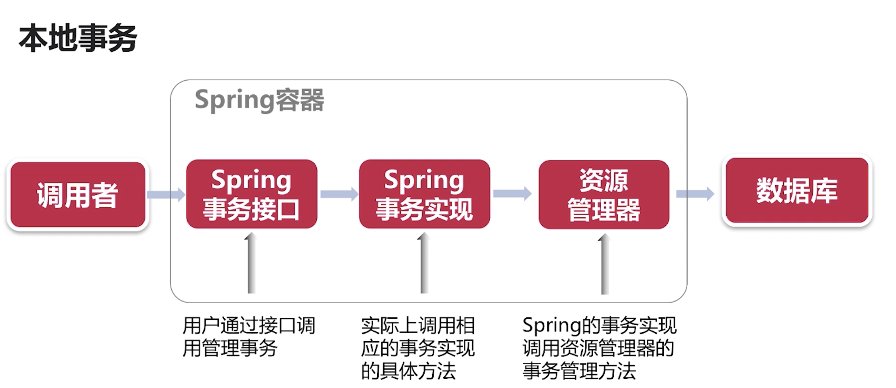
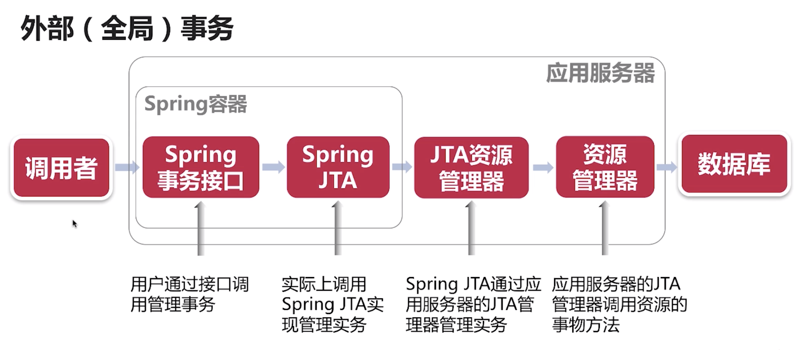
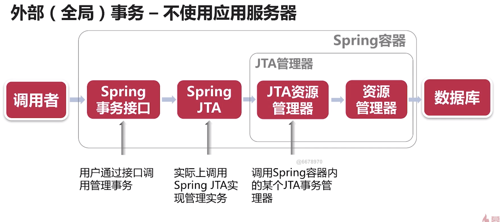
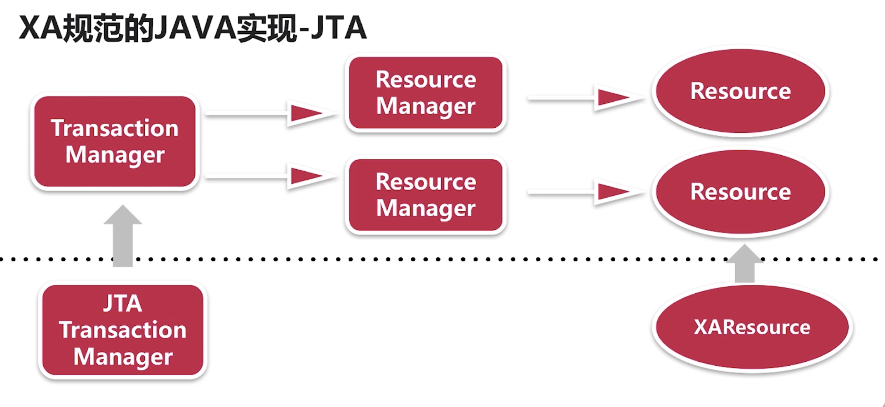

# 外部事务jta


* Spring 本地事务和外部事务；
* jta与spring jta的实现；
* jta与xa 
* jta分布式事务实现。


## Spring 本地事务和外部事务

* 本地事务
  * spring 容器管理事务的生命周期；
  * 通过spring事务接口调用；
  * 业务代码与具体事务实现无关；



* 外部事务
  * 外部事务管理器提供事务管理 
  * 通过spring的事务接口，调用外部事务管理器
  * 通过jndi等方式获得外部事务管理器的实例
  * 外部事务管理器一由应用服务器提供，如jboss等 

* 外部(全局)事务-jta
  * 外部事务管理器提供jta事务管理
  * jta事务管理器可以管理多个数据源
  * 通过2阶段提交实现多数据源的事务（第二阶段提交数据才真正的持久化）


  


## jta与xa

* xa
  * transaction manger  
  * xa resource
  * 两阶段提交
* jta是xa在java中的具体实现，定义了3个接口
  * TransactionManager
  * XAResource
  * XID





* JTA的弊端
 * 两阶段提交
 * 事务时间长、锁数据时间长；
 * 低性能，低吞吐量


 ## jta实现单数据源的实例

* 使用spring jta事务管理；
* atomikos外部事务管理器提供jta事务管理；
* 使用一个数据库，单数据源。


* 如下程序中指需要加入``spring-boot-starter-jta-atomikos``依赖,程序就会自动使用atomikos帮助我们做现有事务的事务管理。

```xml
<dependencies>
		<dependency>
			<groupId>org.springframework.boot</groupId>
			<artifactId>spring-boot-starter-data-jpa</artifactId>
		</dependency>
		<dependency>
			<groupId>org.springframework.boot</groupId>
			<artifactId>spring-boot-starter-web</artifactId>
		</dependency>
		<dependency>
			<groupId>org.springframework.boot</groupId>
			<artifactId>spring-boot-starter-jta-atomikos</artifactId>
		</dependency>

		<dependency>
			<groupId>com.h2database</groupId>
			<artifactId>h2</artifactId>
			<scope>runtime</scope>
		</dependency>
		<dependency>
			<groupId>org.projectlombok</groupId>
			<artifactId>lombok</artifactId>
			<optional>true</optional>
		</dependency>
		<dependency>
			<groupId>org.springframework.boot</groupId>
			<artifactId>spring-boot-starter-test</artifactId>
			<scope>test</scope>
		</dependency>
	</dependencies>

```

