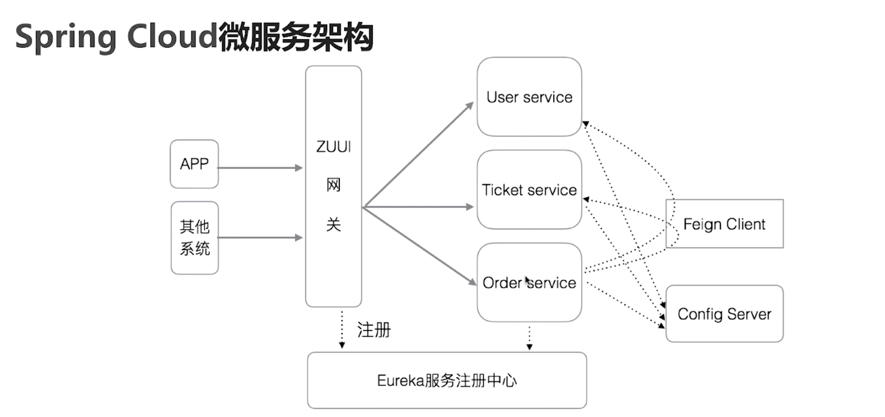

# spring cloud微服务架构

* 微服务架构的组成部分；
* spring cloud微服务架构
* 例子

## 组成

* 服务
* 服务器注册中心
* 网关
* 服务间的调用协议；

## springcloud的微服务架构

* spring cloud netflix
  * eureka
  * zuul 
  * 声明式调用接口:fegin clinet
  * 负载均衡: ribbon
  * 监控和熔断:hystrix &  hystrix dashboard
* spring cloud config
  * 文件夹、git、svn、db
* spring cloud bus事件总线

