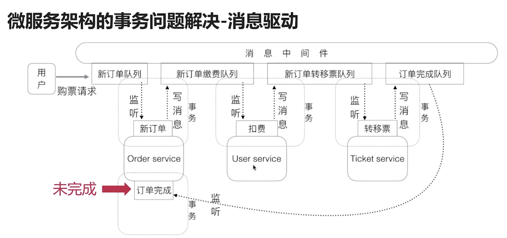
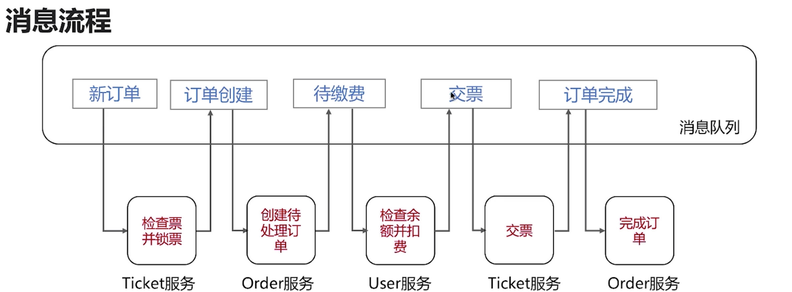

# 分布式事务-消息驱动模式

## 微服务架构的事务问题

* 服务间调用操作的会滚
* 服务间调用失败的回滚

## 消息驱动的原理

 

* 一个服务完成操作之后，发消息给下一个服务，下一个服务收到消息继续下一步骤；
* 消息重试，服务之间调用要考虑幂等性，如果处理失败，重复补偿执行；
* 消息失败回滚：
   * 方法1: 消息失败发送失败消息到失败队列中，其他服务监听失败队列，回滚对应的业务；
   * 方法2: 做一个定时器，在一定时间内没有完成的事务回滚；
   * 方法3: 保存错误消息，人工处理。

> 1. 消息中间件需要支持事务；
> 1. 如何处理重试消息；
> 1. 发生业务异常的回滚操作。

## 实例1

